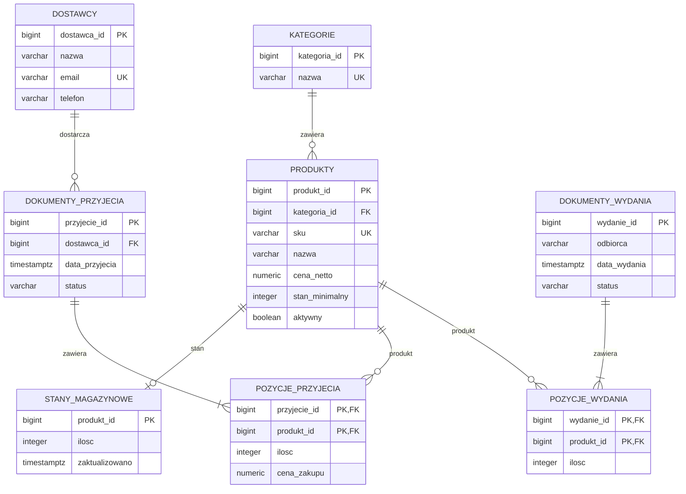

# Diagram ERD

```mermaid
erDiagram
    KATEGORIE ||--o{ PRODUKTY : zawiera
    DOSTAWCY ||--o{ DOKUMENTY_PRZYJECIA : dostarcza
    PRODUKTY ||--o| STANY_MAGAZYNOWE : stan
    DOKUMENTY_PRZYJECIA ||--|{ POZYCJE_PRZYJECIA : zawiera
    PRODUKTY ||--o{ POZYCJE_PRZYJECIA : produkt
    DOKUMENTY_WYDANIA ||--|{ POZYCJE_WYDANIA : zawiera
    PRODUKTY ||--o{ POZYCJE_WYDANIA : produkt

    KATEGORIE {
        bigint kategoria_id PK
        varchar nazwa UK
    }

    DOSTAWCY {
        bigint dostawca_id PK
        varchar nazwa
        varchar email UK
        varchar telefon
    }

    PRODUKTY {
        bigint produkt_id PK
        bigint kategoria_id FK
        varchar sku UK
        varchar nazwa
        numeric cena_netto
        integer stan_minimalny
        boolean aktywny
    }

    STANY_MAGAZYNOWE {
        bigint produkt_id PK
        integer ilosc
        timestamptz zaktualizowano
    }

    DOKUMENTY_PRZYJECIA {
        bigint przyjecie_id PK
        bigint dostawca_id FK
        timestamptz data_przyjecia
        varchar status
    }

    POZYCJE_PRZYJECIA {
        bigint przyjecie_id PK, FK
        bigint produkt_id PK, FK
        integer ilosc
        numeric cena_zakupu
    }

    DOKUMENTY_WYDANIA {
        bigint wydanie_id PK
        varchar odbiorca
        timestamptz data_wydania
        varchar status
    }

    POZYCJE_WYDANIA {
        bigint wydanie_id PK, FK
        bigint produkt_id PK, FK
        integer ilosc
    }
```

**PK** – klucz główny, **FK** – klucz obcy, **UK** – wartość unikalna.
